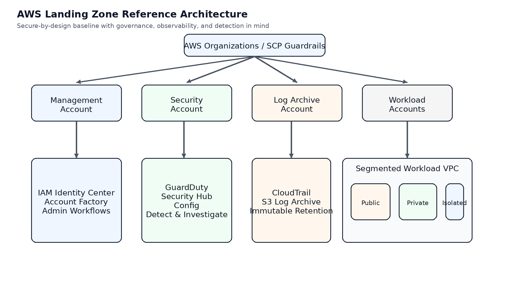
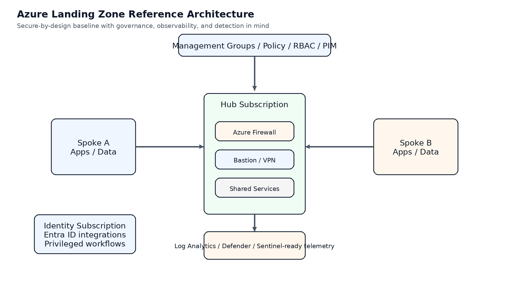
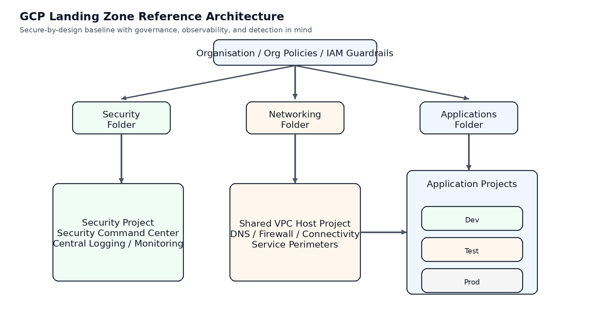

# Cloud Landing Zone Accelerators (AWS | Azure | GCP | OCI)

Secure, production ready cloud foundations with Infrastructure as Code and built-in threat detection.


## The problem

Most cloud projects waste weeks rebuilding the same foundations:

* Networking
* Identity
* Logging
* Security controls

Before delivering any real value.

---


## The solution


This repository provides ready-to-deploy landing zone accelerators that are:

* 1. Secure by design
* 2. Built with Infrastructure as Code
* 3. Observable and threat-aware
* 4. Multi-cloud (AWS, Azure, GCP, OCI)

Deploy a secure cloud foundation in minutes, not weeks.

---
## Quick Value
##  What you get in minutes

- Deploy a secure cloud foundation  
- Pre-configured networking and segmentation  
- Built-in logging and monitoring  
- Security controls aligned to best practices  
- A baseline ready for production workloads  

---
## Architecture Overview

### AWS



### Azure



### GCP



---


## What’s included

### AWS


* Multi-account architecture (Organization-based)
* VPC segmentation (public / private / isolated)
* GuardDuty, CloudTrail, logging baseline
* Terraform starter

### Azure

* Management groups + subscription model
* Hub-spoke networking
* Defender + Log Analytics baseline
* Bicep + Terraform

### GCP

* Org → Folder → Project model
* Shared VPC design
* IAM + logging baseline
* Terraform starter

### OCI (Optional)

* Compartment-based landing zone
* VCN + IAM + Cloud Guard concepts

---

## Secure-by-design first

All landing zones include:

* Least privilege access models
* Centralised logging
* Network segmentation
* Policy enforcement
* Secure defaults (no public exposure by default)

---


## STRIDE → Threat Hunting (What makes this different)


Most landing zone designs stop at architecture.

This one goes further, linking threat modelling → detection engineering.


 STRIDE                 | Detection Focus                     


 Spoofing               | Suspicious logins / role assumptions 

 Tampering              | Policy and configuration drift      

 Repudiation            | Unattributed privileged actions      

 Information Disclosure | Data exfiltration patterns          

 Denial of Service      | Traffic spikes / abuse               

 Privilege Escalation   | Role changes + sensitive API calls   


See full mappings: `docs/stride-threat-hunting-mappings.md`


---

## Quick Start

```bash

# Example (AWS Terraform)

cd aws/terraform

terraform init

terraform apply

```

---


## Why this matters

A landing zone is not just infrastructure.


It is:

* Your security boundary
* Your audit evidence source
* Your incident investigation foundation

If it's designed insecurely, it will be built insecurely, everything on top of it is at risk.

---
## Example use case

A company starting cloud adoption typically needs:

- Secure network design  
- Identity and access controls  
- Logging for compliance and incident response  

This landing zone provides a starting point to:

- Reduce deployment time  
- Avoid common misconfigurations  
- Enable security teams to monitor effectively from day one  

---

## Repository structure

- `/aws` – AWS landing zone + Terraform  
- `/azure` – Azure landing zone + Bicep/Terraform  
- `/gcp` – GCP landing zone + Terraform  
- `/oci` – OCI landing zone (optional)  
- `/docs` – Architecture, STRIDE, and threat hunting
---

## Who this is for

* Security architects
* Cloud engineers
* Platform teams
* Organisations building secure cloud environments

---

## 👤 Author

Saleem Yousaf

Cybersecurity Architect | Cloud Security | Zero Trust

---

## ⭐ Support

If this repository helped you:
* Star ⭐ the repo
* Share it with your network
* Open an issue or suggest improvements 


